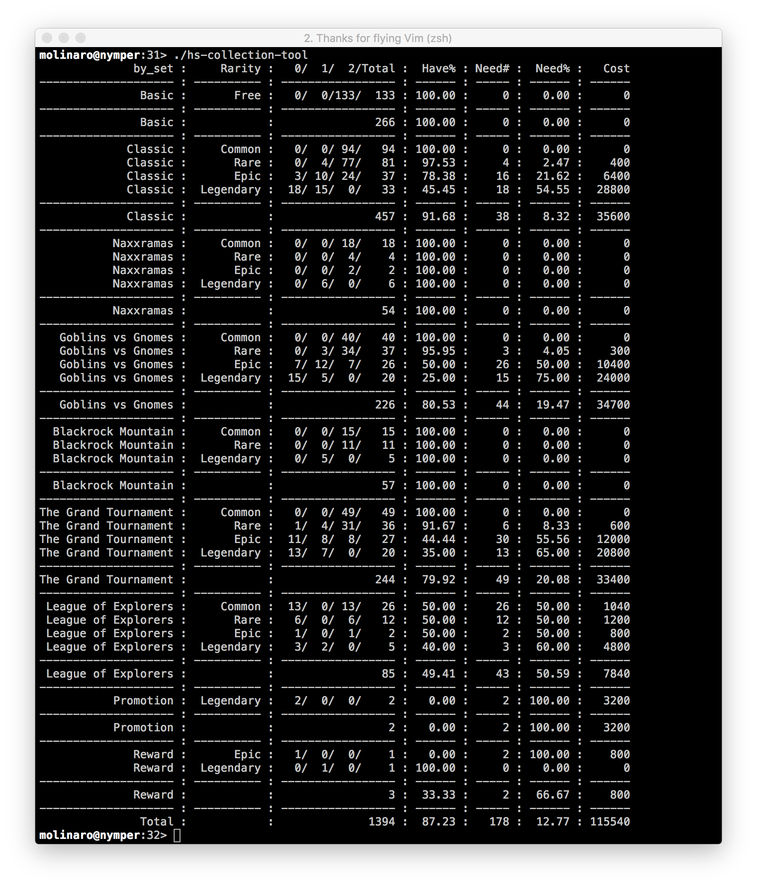
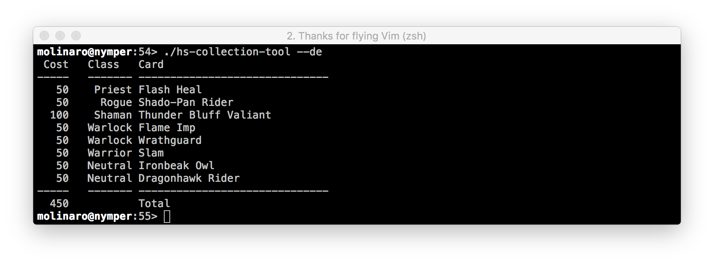
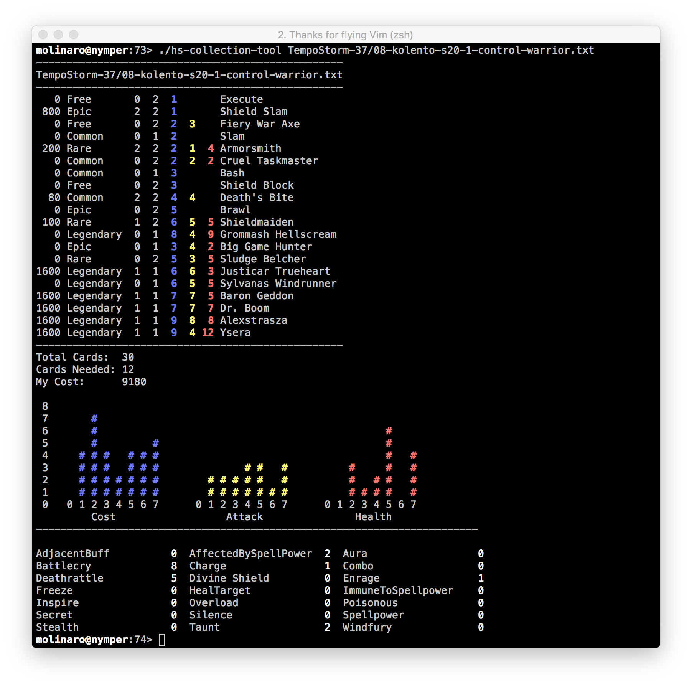
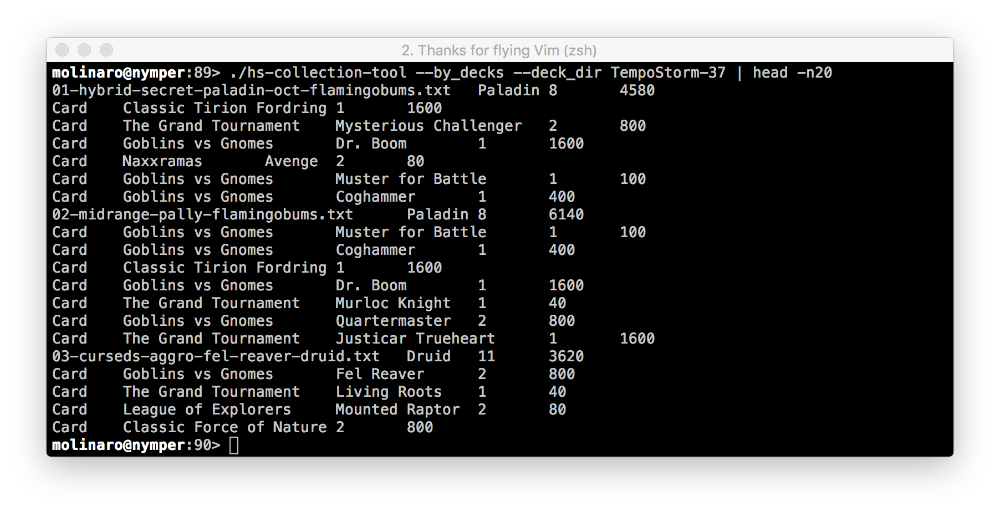
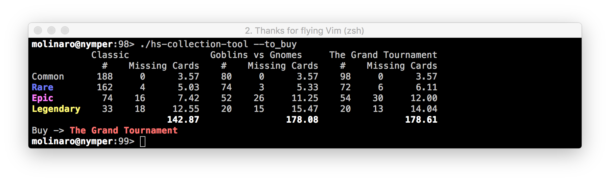

# hearthstone-tools

Here are some tools I developed mostly for managing a collection of hearthstone cards.  It will help you determine how
much it would cost to create a deck taken from an online site like hearthhead or hearthpwn, as well as give you some
info about which sets you should buy or how much excess dust is in your current set.

## getting setup
```
> git clone git@github.com:djnym/hearthstone-tools.git
> cd hearthstone-tools
```
Optionally copy ```hs-collection-tool``` into a bin directory.

## initializing the data file
The first time you run ```hs-collection-tool``` it will download and initialize a datafile called ```Hearthstone-Cards.txt```.
The datafile is a tab delimited file (perfect for piping to things like cut, sort, etc).  If you want to use a different database
or are managing more than one collection you can use the ```--db <database file>``` option.  The file is formatted in the
same order as the collection manager in hearthstone to ease in inputing data.

## inputing data
After you've run ```hs-collection-tool``` and it's downloaded and initialized, you need to input your cards (sorry, but
I don't have the time for a fancy scraper, so it's hand entry for now).  In order to make it easier for you the list is
sorted the same as in the collection manager assuming you do the following.

1. open the collection in hearthstone
2. click 'crafting'
3. click 'include uncraftable cards'
4. open the ```Hearthstone-Cards.txt``` in a text editor
5. add the number of normal and golden cards in the appropriate columns

## View information about the completeness of your collection
Once you've input all your cards, running ```./hs-collection-tool``` will give you something like

Which is a lot of numbers, but gives you a good sense of where you are, and what it would cost in dust to complete
a collection.  The numbers in the third column attempt to give you a sense of what you are missing by breaking it
down by the number you have of each rarity.  So a line like
```
             Classic :       Rare :   0/  4/ 77/   81 :  97.53 :     4 :   2.47 :    400
```
is telling you that for the Classic Rare cards, there are 0 cards which you have 0 of, 4 cards which you have 1 of,
and 77 cards which you have 2 of (more than 2 will not change these numbers).  So overall you have 97.53 % of the cards,
are missing 4 cards total (2.47 %), and it would cost 400 in dust to craft those 4 cards.  In addition you can see the
total dust cost to complete each set, as well as the total dust for a complete collection.

## Disenchant View
Excess dust is any golden cards which you have 2 regular cards for.   This is mostly for those who don't care about
gold cards, but do care about a full collection.  You can invoke as
```
> ./hs-collection-tool --de
```
Which results in output like

This just gives you a dust value, a card and the total dust available.

## Deck View
There are a couple of modes which allow you to determine if you have all the cards for a particular deck and if now how much
dust would be required to craft the remaing cards.  This mode requires decks to have been downloaded from a deck site in
"cockatrice" format.  In addition, there is a tool which will dowload the latest meta report from tempostorm called
```tempostorm-dl``` which will grab the latest meta decks.

So lets say you want to see if you can craft the latest control warrior from the tempostorm meta.  First run
```
> ./tempostorm-dl
```
Which will create a directory called 'TempoStorm-#' in the current directory where '#' is the current report (in this
example it was 37).

In this particular case the current control warrior deck is called '08-kolento-s20-1-control-warrior.txt' so in order
to see what it looks like you can run
```
> ./hs-collection-tool TempoStorm-37/08-kolento-s20-1-control-warrior.txt
```
and see the following output


The first section is the cards in the deck.  The leftmost column is the cost in dust, the rest of the columns represent
the rarity, number of cards you need, number of cards required for the deck, mana cost for the card, attack for the card,
health of the card and finally the name of the card.

Next is the cost, followed by various views of the curves of the deck and the counts of the mechanics.

## Multi Deck View
In addition to the single deck view it's possible to get values based on an entire directory of decks.  So given the example above
of the TempoStorm-37 meta decks, you could run
```
> ./hs-collection-tool --by_decks --deck_dir TempoStorm-37
```
and get something like this (clipped for example)

This shows the cards needed, their set, and dust cost.

## What to buy

There's a nifty spreadsheet [here](https://docs.google.com/spreadsheets/d/1VdqhpiremPEiIKmS1YI8_8HkdYb57wb8cD4ZLnxtffU/edit#gid=579362856)
which had a calculation I added here.  This determines which expansion type you should buy in order to most efficiently complete
your collection.  It's based on an estimated amount of dust you can get given the number of cards of a particular expansion you
already own.  In order to get these numbers you can run
```
> ./hs-collection-tool --to_buy
```
and get output like

Which in this case is saying that in order to maximize our chances of completely our collection we should buy 'The Grand Tournament' packs.

## More?

If there are things you would like to see please send pull requests or feature requests.  Hopefully others find this useful.

